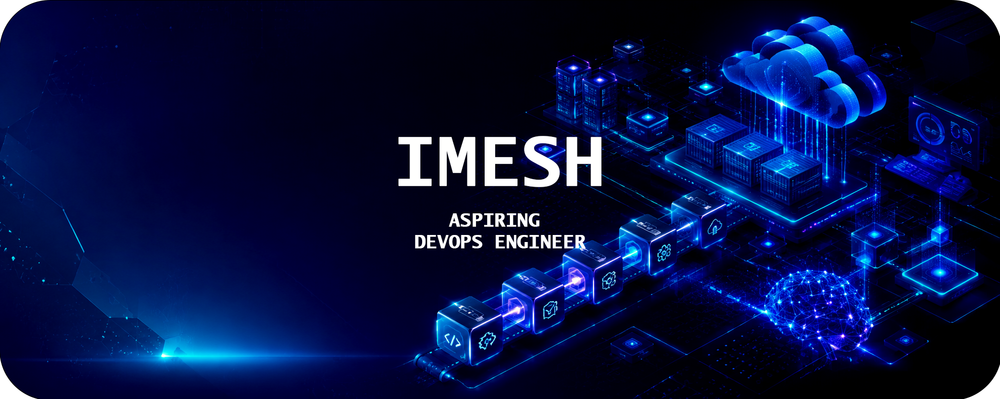
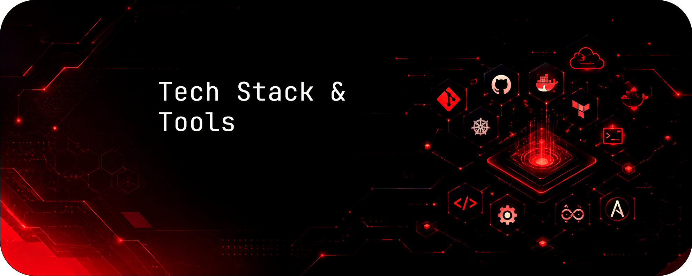
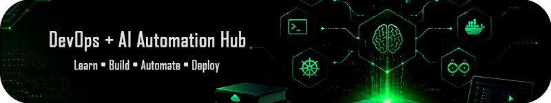

# Imesh Adhithya

### **SE Student • DevOps Learner • AI Automation Enthusiast**

`DevOps` • `CI/CD` • `Docker` • `Linux` • `AI Automation & Intergration` • `AI Infrastructure` • `Cloud(Learning)`

### _Learning to build automated, cloud-ready systems through DevOps and AI_

---

# 👋 About Me

I'm a Software Engineering student building my foundation in DevOps and infrastructure automation — currently comfortable working with Docker and the Linux terminal, and learning CI/CD pipelines to understand how software actually gets shipped, not just written.

Alongside that, I'm starting to explore AI and automation concepts — how intelligent systems can fit into the tools and workflows developers already use.

I'm drawn to projects that combine solid engineering fundamentals with practical automation — the kind of work that sits at the intersection of DevOps and AI-driven systems.

---

# 📊 GitHub Statistics

<table>
<tr>
<td align="center">

</td>

<td align="center">

</td>
</tr>

<tr>
<td align="center">

</td>

</tr>

</table>

---

# ⚡ Tech Stack

## ☁️ Cloud

## 🚀 DevOps & Platform

## 📊 Observability

## 🤖 Languages & Tools

---

# 🧠 Current Focus

<table>
  <tr>
    <td>Platform Engineering</td>
    <td>Internal Developer Platforms (IDP)</td>
    <td>DevOps Automation</td>
  </tr>
  <tr>
    <td>Cloud Native Infrastructure</td>
    <td>Kubernetes</td>
    <td>GitOps</td>
  </tr>
  <tr>
    <td>MLOps</td>
    <td>LLMOps</td>
    <td>AI Infrastructure</td>
  </tr>
  <tr>
    <td>Generative AI</td>
    <td>AI Agents</td>
    <td>Agentic AI Systems</td>
  </tr>
  <tr>
    <td>Multi-Agent Architectures</td>
    <td>Model Context Protocol (MCP)</td>
    <td>Agent2Agent (A2A)</td>
  </tr>
  <tr>
    <td>LangGraph</td>
    <td>LangChain</td>
    <td>Google ADK</td>
  </tr>
  <tr>
    <td>Context Engineering</td>
    <td>Prompt Engineering</td>
    <td>Retrieval-Augmented Generation (RAG)</td>
  </tr>
  <tr>
    <td>AI Automation</td>
    <td>Developer Experience (DevEx)</td>
    <td></td>
  </tr>
</table>

---

# 🌐 Learning Hub

| Resource                   | Description                      |
| -------------------------- | -------------------------------- |
| 📚 Docs Portal             | DevOps, Cloud & AI documentation |
| 💻 Projects Hub            | Hands-on real-world projects     |
| ☸️ Kubernetes Learning     | Beginner → CKA                   |
| 🐳 Docker to Kubernetes    | Complete container journey       |
| 🤖 MLOps Generator         | Production-ready MLOps templates |
| ⚙️ DevOps Generator        | DevOps project scaffolding       |
| ☁️ AWS Infra Generator     | AWS infrastructure templates     |
| 📊 Monitoring in a Box     | Observability stack              |
| 🤖 AI Platform Engineering | AI infrastructure resources      |
| 🧠 Agentic AI              | AI Agent learning resources      |
| 🔗 MCP Learning            | Model Context Protocol resources |
| 📦 Repositories Hub        | Open-source projects             |

---

### 💙

